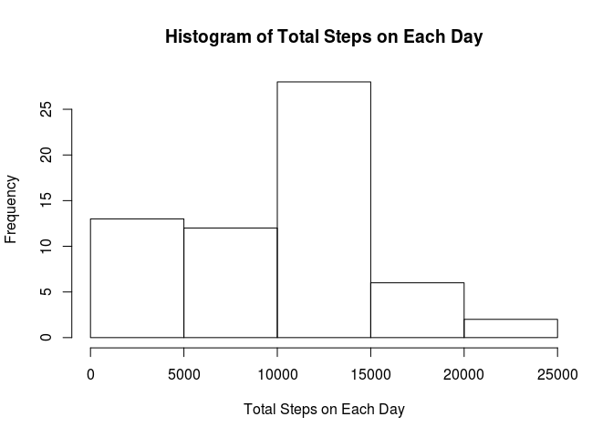
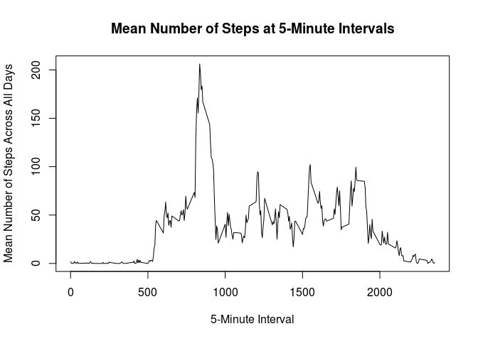
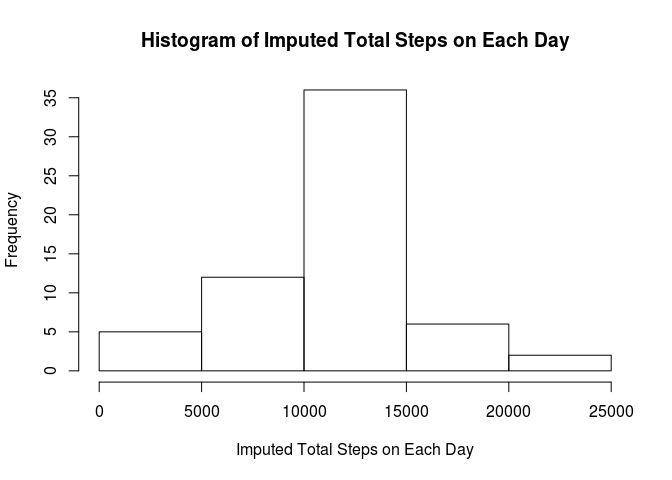
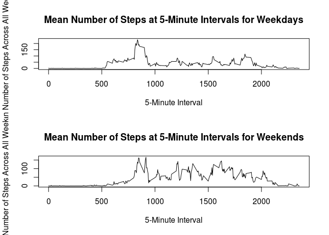

# Reproducible Research: Peer Assessment 1


```
## 
## Attaching package: 'dplyr'
```

```
## The following objects are masked from 'package:stats':
## 
##     filter, lag
```

```
## The following objects are masked from 'package:base':
## 
##     intersect, setdiff, setequal, union
```

## Loading and preprocessing the data

The first step is to load and preprocess the data.  Unzip the file to begin:


```r
unzip("activity.zip")
```

Then, load the data into a data frame call `activity`:


```r
activity <- read.csv("activity.csv")
```

Check the data frame to see if we need any processing or transformation:


```r
str(activity)
```

```
## 'data.frame':	17568 obs. of  3 variables:
##  $ steps   : int  NA NA NA NA NA NA NA NA NA NA ...
##  $ date    : Factor w/ 61 levels "2012-10-01","2012-10-02",..: 1 1 1 1 1 1 1 1 1 1 ...
##  $ interval: int  0 5 10 15 20 25 30 35 40 45 ...
```

It looks like the date column is stored as a factor, not a date.  Let's convert that to a date and group the data by date in a new data frame.  This used the `dplyr` package that is loaded without displaying to the screen.


```r
activity$date <- as.Date(activity$date)

activity_by_date <- group_by(activity, date)
```

## What is mean total number of steps taken per day?

First, let's create a variable, `total_steps`,  holding the total number of steps taken on each day.  We also rename the column header on the second column.


```r
total_steps <- summarize(activity_by_date, sum(steps, na.rm = TRUE))
names(total_steps)[2] <- "sum"

total_steps
```

```
## # A tibble: 61 x 2
##          date   sum
##        <date> <int>
## 1  2012-10-01     0
## 2  2012-10-02   126
## 3  2012-10-03 11352
## 4  2012-10-04 12116
## 5  2012-10-05 13294
## 6  2012-10-06 15420
## 7  2012-10-07 11015
## 8  2012-10-08     0
## 9  2012-10-09 12811
## 10 2012-10-10  9900
## # ... with 51 more rows
```

Here is a histogram of the total steps each day:


```r
hist(total_steps$sum, xlab = "Total Steps on Each Day", main = "Histogram of Total Steps on Each Day")
```

<!-- -->

The mean number of steps each day is:


```r
mean(total_steps$sum)
```

```
## [1] 9354.23
```

The median number of steps each day is:


```r
median(total_steps$sum)
```

```
## [1] 10395
```

## What is the average daily activity pattern?

Let's return to the original data frame and group on 5-minute interval this time.  Again, this uses the `dplyr` package.


```r
activity_by_interval <- group_by(activity, interval)
```

Now, put the mean for each interval into a new variable, `mean_steps` and rename the mean column:


```r
mean_steps <- summarize(activity_by_interval, mean(steps, na.rm = TRUE))
names(mean_steps)[2] <- "mean"
```

Let's plot this variable in a time series to see how activity fluctuates throughout the day:


```r
plot(mean_steps$interval, mean_steps$mean, type = "l", xlab = "5-Minute Interval", ylab = "Mean Number of Steps Across All Days", main = "Mean Number of Steps at 5-Minute Intervals")
```

<!-- -->

Find the 5-minute interval that has the largest average number of steps:


```r
mean_steps[mean_steps$mean == max(mean_steps$mean), ]
```

```
## # A tibble: 1 x 2
##   interval     mean
##      <int>    <dbl>
## 1      835 206.1698
```

## Imputing missing values

First, find the number of rows with missing values:


```r
length(activity[is.na(activity$steps), 2])
```

```
## [1] 2304
```

```r
length(activity[is.na(activity$date), 3])
```

```
## [1] 0
```

```r
length(activity[is.na(activity$interval), 1])
```

```
## [1] 0
```

As you can see, all missing values are in the `steps` column.

For each row with a missing number of steps, let's fill in the average number of steps from that interval using the `mean_steps` variable.  First, create an `imputedactivity` variable as a copy of the `activity` data frame.


```r
imputedactivity <- activity
```

Then, run a for loop to replace NA steps with the corresponding value from `mean_steps`:


```r
i <- 0
for(item in imputedactivity$steps) {
  if(is.na(item)){
    imputedactivity[i, "steps"] <- mean_steps[imputedactivity[i, "interval"] == mean_steps$interval, 2]
  }
  i <- 1 + i
}
```

Let's see the histogram, mean, and median for this new data frame by repeating what we did above.


```r
imputedactivity_by_date <- group_by(imputedactivity, date)
imputed_total_steps <- summarize(imputedactivity_by_date, sum(steps, na.rm = TRUE))
names(imputed_total_steps)[2] <- "sum"
hist(imputed_total_steps$sum, xlab = "Imputed Total Steps on Each Day", main = "Histogram of Imputed Total Steps on Each Day")
```

<!-- -->

```r
mean(imputed_total_steps$sum)
```

```
## [1] 10766.17
```

```r
median(imputed_total_steps$sum)
```

```
## [1] 10765.11
```

Note how the imputed values have a larger frequency around the middle of the histogram.  Both the mean and median increased as may be expected by adding more values to the data frame.  Additionally, the variance between the mean and median declined as we were adding more values that clustered naturally around the mean.

## Are there differences in activity patterns between weekdays and weekends?

First, create a variable to hold the days of the week for the data frame:


```r
dayofweek <- weekdays(imputedactivity$date)
```

Then, `cbind` it to the data frame and make it a character element:


```r
imputedactivity <- cbind(imputedactivity, dayofweek)
imputedactivity$dayofweek <- as.character(imputedactivity$dayofweek)
```

Now, use a function to convert the values to either "weekend" or "weekday" and store as a factor:


```r
i <- 0
for(item in imputedactivity$dayofweek) {
  if(item == "Sunday" | item == "Saturday"){
    imputedactivity[i, "dayofweek"] <- "weekend"
  }
  else{
    imputedactivity[i, "dayofweek"] <- "weekday"
  }
  i <- 1 + i
}

imputedactivity$dayofweek <- as.factor(imputedactivity$dayofweek)
```

Finally, create a panel plot with a time series plot of 5-minute intervals and the average number of steps taken, averaged across all weekdays or weekend days.  Much of the code to make the plots is copied from above.


```r
imputedactivity_by_interval <- group_by(imputedactivity, interval)

day_mean_steps <- summarize(imputedactivity_by_interval[imputedactivity_by_interval$dayofweek == "weekday", ], mean(steps, na.rm = TRUE))
names(day_mean_steps)[2] <- "mean"

end_mean_steps <- summarize(imputedactivity_by_interval[imputedactivity_by_interval$dayofweek == "weekend", ], mean(steps, na.rm = TRUE))
names(end_mean_steps)[2] <- "mean"

par(mfrow = c(2,1))
plot(day_mean_steps$interval, day_mean_steps$mean, type = "l", xlab = "5-Minute Interval", ylab = "Mean Number of Steps Across All Weekdays", main = "Mean Number of Steps at 5-Minute Intervals for Weekdays")
plot(end_mean_steps$interval, end_mean_steps$mean, type = "l", xlab = "5-Minute Interval", ylab = "Mean Number of Steps Across All Weekend Days", main = "Mean Number of Steps at 5-Minute Intervals for Weekends")
```

<!-- -->
